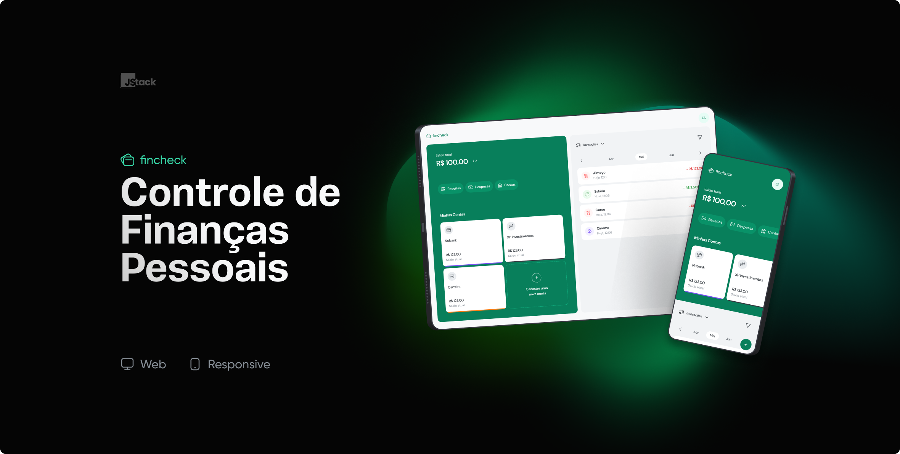

# Fincheck - Controle de finanças

### Fincheck é uma aplicação para gerenciamento de finanças pessoais. Monitore seus gastos de forma simples, podendo filtrar por conta, categoria e data.

#### App disponível em: https://fincheck-frontend.vercel.app

 

## 👩‍💻 Tecnologias usadas

### Back-end

    * NestJS
    * Typescript
    * PostgreSQL
    * Prisma
    * Docker
    * JWT

### Front-end Web

    * React / Vite
    * Typescript
    * TailwindCSS
    * Zod
    * React Query
